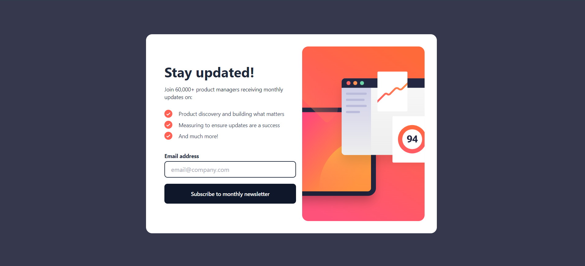

# Frontend Mentor - Newsletter sign up solution

This is a solution to the [Newsletter sign-up form with success message challenge on Frontend Mentor](https://www.frontendmentor.io/challenges/newsletter-signup-form-with-success-message-3FC1AZbNrv).

## Overview

### The challenge

Users should be able to:

- Add their email and submit the form
- See a success message with their email after successfully submitting the form
- See the form validation messages if:
    - The field is left empty
    - The email address is not formatted correctly
- See hover and focus states for all interactive elements on the page

### Screenshot

### Links

- Solution URL:(https://github.com/cazanca/newsletter-sign-up)
- Live Site URL: (https://newsletter-sign-up-self.vercel.app/)

### Built with

- Semantic HTML5 markup
- CSS custom properties
- Flex box
- [Vue](https://vuejs.org/) - JS library
- [Tailwindcss](https://tailwindcss.com/) - A utility-first CSS framework

## Author

- Frontend Mentor - [@cazanca](https://www.frontendmentor.io/profile/cazanca)